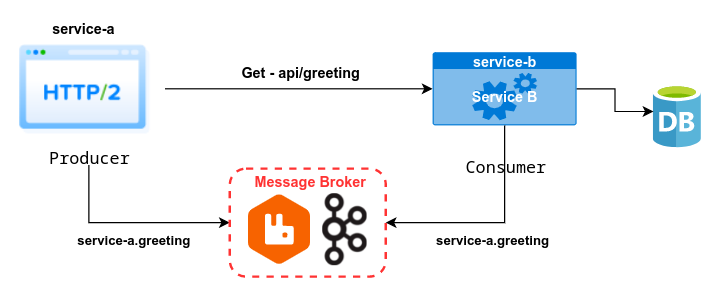
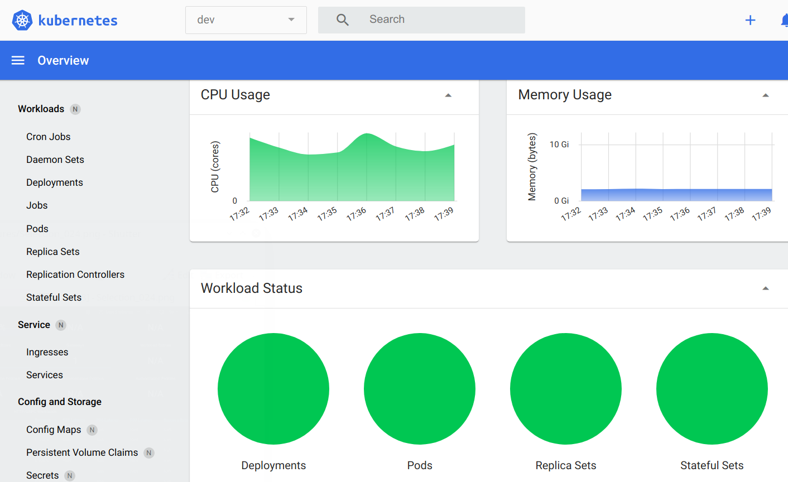
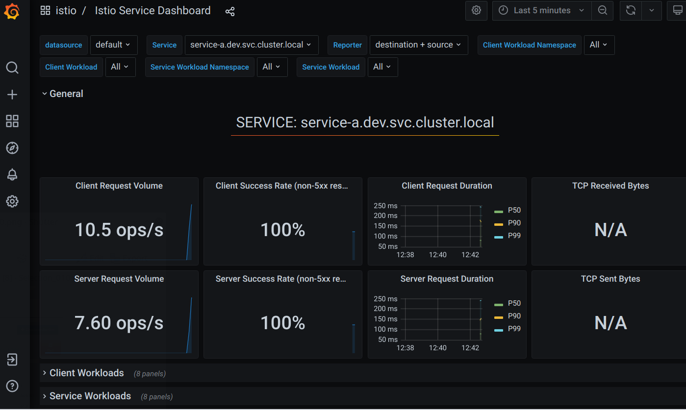
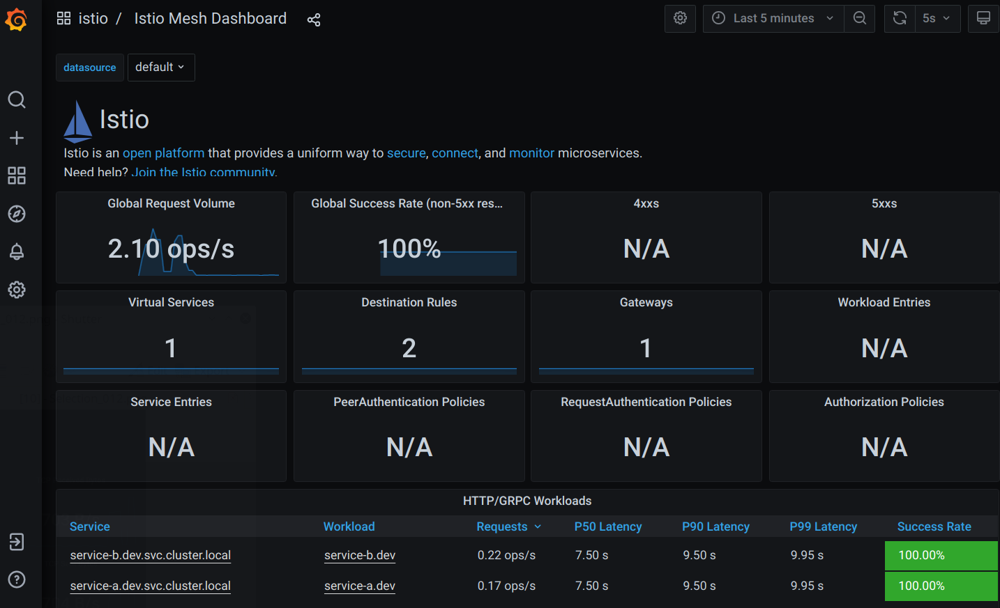
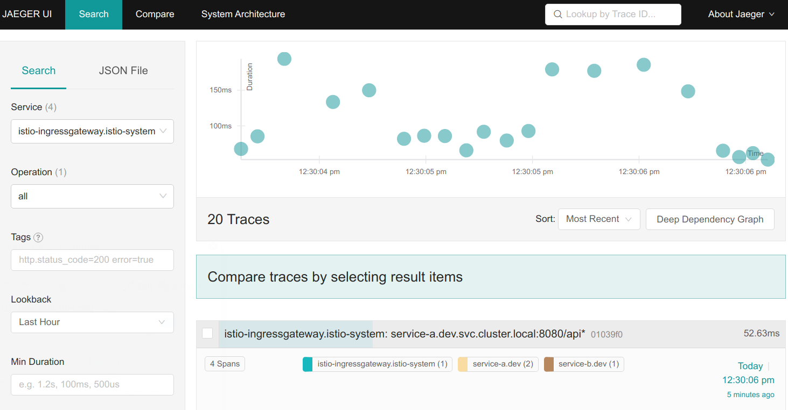
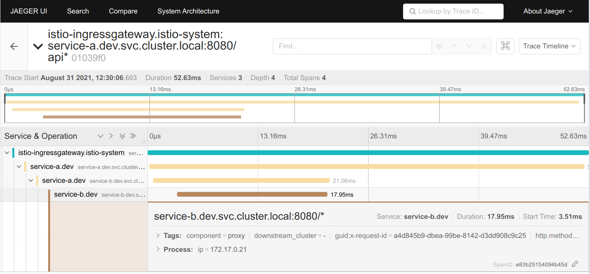
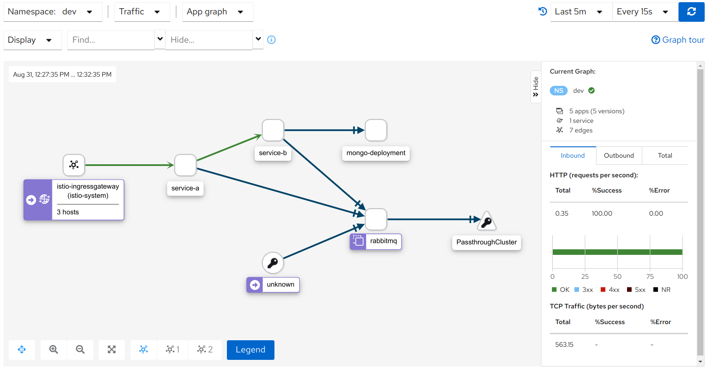
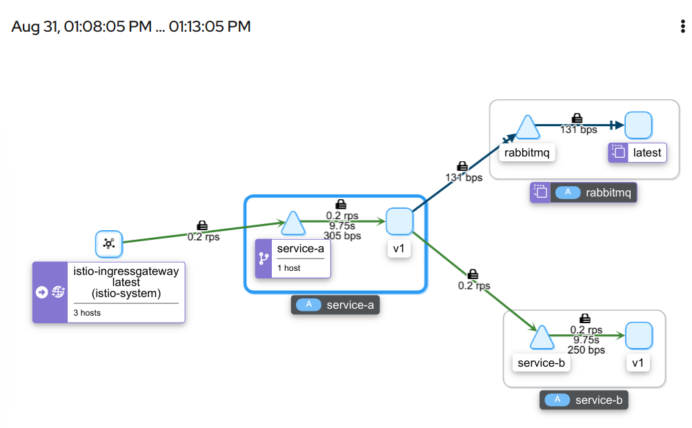
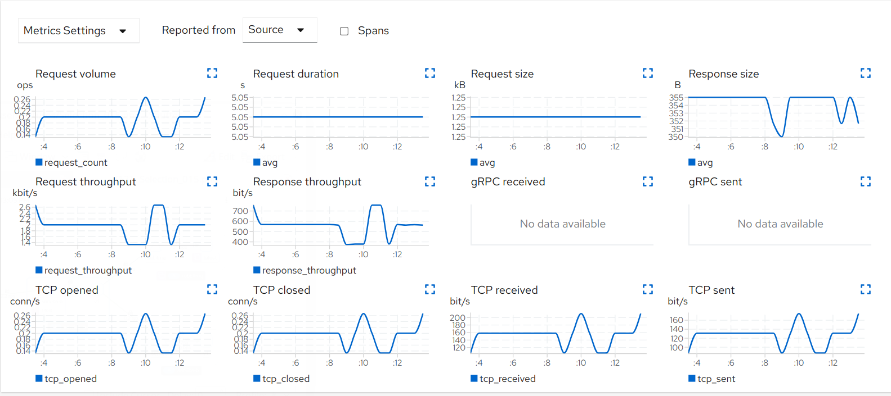

# producer-consumer-k8s

Permite iniciar un cluster kubernetes y cargar la configuración iniciando servicios conectados a un Broker Message.

Services Applications

* Service service-a
  * Send data to service-b
  * Producer in Broker
* Service service-b
  * Save data in MongoDB
  * Consumer in Broker

Architecture Docker Images

* service-a - build [./services/service-a](./services/service-a/main.go) or [janusky/service-a](https://hub.docker.com/repository/docker/janusky/service-a)
* service-b - build [./services/service-b](./services/service-b/main.go) or [janusky/service-b](https://hub.docker.com/repository/docker/janusky/service-b)
* rabbitmq - [rabbitmq:3.8.16-management-alpine](https://hub.docker.com/_/rabbitmq)
* mongodb - [mongo:5.0.2](https://hub.docker.com/_/mongo)
* mongo-express - [mongo-express:1.0.0-alpha.4](https://hub.docker.com/_/mongo-express)

Accesos de interés

* [Configurar Entorno/PC](#entorno)
* [Ejecutar con Kubernetes](#run)
* [Ejecutar con docker-compose](./docs/DOCKER_RUN.md)
* [Monitoreo](#observability)

## Objetivo

Se pretende reflejar escenario donde interactúan **Microservicios**, conectados a un **Broker** de mensajes y una base de datos **NoSql** (MongoDB).

Utilizando kubernetes para desplegar dichos servicios, permitiendo auto escalamiento y monitoreo del ecosistema/cluster (con Istio).

Propose architecture



## Entorno

Antes de comenzar se debe contar con el entorno apropiado para ejecutar está aplicación.

* Instalar implementación de Kubernetes (Minikube)
* Instalar cliente Istio (Istioctl)
* [Configure Detail](./docs/CONFIG_PC.md)

## Run

Tener presente que **Minikube** se inicia con 6GB, pero podría probar cambiar este valor según las características del equipo donde se ejecuta. Por defecto funciona bien indicando 8GB de RAM `minikube start --memory=8GB`.

>**NOTA**  
>Se puede ejecutar la arquitectura utilizando [docker-compose](./docs/DOCKER_RUN.md). 

A disposición un modo [fácil](#run-for-dummies) y [paso a paso](#run-step-by-step). Se recomienda a los desarrolladores proceder con la ejecución paso a paso para obtener una mayor comprensión.

* [Run for dummies](#run-for-dummies)
* [Run step by step](#run-step-by-step)

>**INFO**  
>Si necesita actualizar docker
>* [See upgrade docker](./docs/DOCKER_INFO.md#upgrade-docker-ce)

Accesos, los mismos indicados en la consola de ejecución

* Kubernetes Dashboard (`minikube dashboard --url`)
* Rabbitmq Manager (guest/guest): http://localhost:15672
* Mongo Express (username/password): http://localhost:8081
* Grafana: http://localhost:3000
* Jaeger: http://localhost:16686
* Kiali: http://localhost:20001
* Zipkin: http://localhost:9411

Ver estado del `cluster` utilizando los comandos provistos en la herramienta [kubectl](https://kubernetes.io/es/docs/tasks/tools/install-kubectl/)

* [Utils commands](#commands)

### Run for dummies

Existe archivo [run-for-dummies.sh](run-for-dummies.sh) tipo `script` que permite ejecutar la aplicación en una sola acción

```sh
# Run (opción 1)
bash run-for-dummies.sh

#====================================================#

# Run experimental (opción 2)
# Consola 1
cat /dev/null > cmd.log && tail -f cmd.log
# Consola 2
bash start.sh
```

### Run step by step

Ejecución paso a paso, o bien ejecutando los comandos involucrados uno a la vez.

>>NOTA: Si en su red tiene problemas para descargar la librerías utilizadas en la construcción de las imágenes de los servicios debe reintentar hasta lograrlo.
>```sh
>..
>error: RPC failed; curl 56 OpenSSL SSL_read: Operation timed out, errno 110
>..
>failed to build LLB: executor failed running [/bin/sh -c go mod tidy]: runc did not terminate sucessfully
>
># También puede ocurrir
>reading https://gopkg.in/alecthomas/kingpin.v2?go-get=1: 502 Server Hangup
>The command '/bin/sh -c go mod tidy' returned a non-zero code: 1
>```

```sh
# Ingresar donde esté copiado el proyecto
cd ~/projects/producer-consumer-k8s

# Create node (if minikube is stop)
# $(minikube ip) = 192.168.49.2
# minikube net default = 192.168.99.0/24,192.168.39.0/24,192.168.49.2
export no_proxy=localhost,127.0.0.1,10.96.0.0/12,192.168.99.0/24,192.168.39.0/24,192.168.49.2

# Create minikube (6GB|8GB)
minikube start --memory=6GB --cpus=4

# Install addons provistos por minikube
minikube addons enable metrics-server

# Install istio
# https://istio.io/latest/docs/setup/additional-setup/config-profiles/
# --set values.sidecarInjectorWebhook.rewriteAppHTTPProbe=false
# istioctl profile list
istioctl install --set profile=demo -y

# Crea namespace y habilita istio
kubectl create namespace dev
kubectl label namespace dev istio-injection=enabled --overwrite

# Necesitamos construir la imagen de forma que esté accesible desde Minikube.
# Para poder trabajar con el daemon de docker desde el host mac/linux es necesario 
# usar el comando docker-env.
# https://minikube.sigs.k8s.io/docs/commands/docker-env/
eval $(minikube docker-env)

# Buscar imágen en DockerHub o crear las imágenes de los servicios desarrollados.
function docker_tag_exists() {
    curl --silent -f -lSL https://index.docker.io/v1/repositories/$1/tags/$2 > /dev/null
}
eval $(minikube docker-env)
IMAGES="service-a service-b"
for IMG in $IMAGES; do
    if docker_tag_exists janusky/$IMG dev; then
        docker pull janusky/$IMG:dev
    else 
        # BUILD_DIR=$1, BUILD_IMAGE=$2
        bash services/build.sh ./$IMG docker.io/janusky/$IMG:dev
    fi
done

# Aplica las configuraciones en el cluster para el namespace 'dev'
kubectl apply -f ./resources -R -n dev
```

## Observability

Se configuran aplicaciones que permiten observar/monitorear los servicios.

* https://istio.io/latest/docs/concepts/observability/

>IMPORTANTE: Se recomienda instalar primero Prometheus, porque este permite exponer métricas utilizadas por las demás herramientas.
> Ver [Prometheus Dashboard](#prometheus-dashboard) o solo aplicar el siguiente comando
>```sh
>kubectl apply -f https://raw.githubusercontent.com/istio/istio/release-1.11/samples/addons/prometheus.yaml
>```

```sh
# Kubernetes Dashboard
minikube dashboard --url &

function awaitCommand() {
    until [[ $(exec bash -c "${@}") ]]
    do
        sleep 2
    done
}

# Rabbitmq Manager
awaitCommand 'kubectl get pod -n dev -l app=rabbitmq | grep Running'
kubectl port-forward --namespace dev svc/rabbitmq 15672:15672 &
echo "URL : http://127.0.0.1:15672/"

# Mongo Express
awaitCommand 'kubectl get pod -n dev -l app=mongo-express | grep Running'
kubectl port-forward --namespace dev svc/mongo-express 8081:8081 &
echo "URL : http://127.0.0.1:8081/" username/password
```



### Prometheus Dashboard

* https://istio.io/latest/docs/ops/integrations/prometheus/

```sh
kubectl apply -f https://raw.githubusercontent.com/istio/istio/release-1.11/samples/addons/prometheus.yaml

# istioctl dashboard prometheus
awaitCommand 'kubectl get pod -n istio-system -l app=prometheus | grep Running'
kubectl -n istio-system port-forward $(kubectl -n istio-system get pod -l app=prometheus -o jsonpath='{.items[0].metadata.name}') 9090:9090 &

http://localhost:9090/
```

### Grafana Dashboard

* https://istio.io/latest/docs/ops/integrations/grafana/

```sh
kubectl apply -f https://raw.githubusercontent.com/istio/istio/release-1.11/samples/addons/grafana.yaml

# istioctl dashboard grafana
awaitCommand 'kubectl get pod -n istio-system -l app=grafana | grep Running'
kubectl -n istio-system port-forward $(kubectl -n istio-system get pod -l app=grafana -o jsonpath='{.items[0].metadata.name}') 3000:3000 &

http://localhost:3000/
```




### Jaeger Dashboard

* https://istio.io/latest/docs/ops/integrations/jaeger/#installation

```sh
kubectl apply -f https://raw.githubusercontent.com/istio/istio/release-1.11/samples/addons/jaeger.yaml

# istioctl dashboard jaeger
awaitCommand 'kubectl get pod -n istio-system -l app=jaeger | grep Running'
kubectl port-forward -n istio-system $(kubectl get pod -n istio-system -l app=jaeger -o jsonpath='{.items[0].metadata.name}') 16686:16686 &

http://localhost:16686/
```




### Kiali Dashboard

* https://istio.io/latest/docs/ops/integrations/kiali/#installation

```sh
kubectl apply -f https://raw.githubusercontent.com/istio/istio/release-1.11/samples/addons/kiali.yaml

# istioctl dashboard kiaki
awaitCommand 'kubectl get pod -n istio-system -l app=kiali | grep Running'
kubectl port-forward svc/kiali 20001:20001 -n istio-system

http://localhost:20001
```





### Zipkin Dashboard

* https://istio.io/latest/docs/ops/integrations/zipkin/#installation

```sh
kubectl apply -f https://raw.githubusercontent.com/istio/istio/release-1.11/samples/addons/extras/zipkin.yaml

awaitCommand 'kubectl get pod -n istio-system -l app=zipkin | grep Running'
kubectl port-forward -n istio-system $(kubectl get pod -n istio-system -l app=zipkin -o jsonpath='{.items[0].metadata.name}') 9411:9411

http://localhost:9411/
```

## Load data

Test **service-a**

```sh
# (Opcional) Si es necesario
export no_proxy=localhost,127.0.0.1,10.96.0.0/12,192.168.99.0/24,192.168.39.0/24,192.168.49.2

# INGRESS_HOST=$(minikube ip)
export INGRESS_HOST=$(kubectl get po -l istio=ingressgateway -n istio-system -o jsonpath='{.items[0].status.hostIP}')
export INGRESS_PORT=$(kubectl -n istio-system get service istio-ingressgateway -o jsonpath='{.spec.ports[?(@.name=="http2")].nodePort}')

curl -v "http://$INGRESS_HOST:$INGRESS_PORT/api/request-echo"
```

Send request

```sh
# One shot
curl -v --noproxy '*' "http://$INGRESS_HOST:$INGRESS_PORT/api/dummy"

curl -v --noproxy '*' -XPOST http://$INGRESS_HOST:$INGRESS_PORT/api/greeting -H 'Content-Type: application/json' -d '{
  "service": "Service service-a",
  "message": "Post, from service-a"
}'

# Iterate
for i in $(seq 1 100); do curl -s -o /dev/null --noproxy '*' "http://$INGRESS_HOST:$INGRESS_PORT/api/dummy"; done

# Iterate with [HEY](https://github.com/rakyll/hey)
hey -n 1000 -c 25 -h2 http://$INGRESS_HOST:$INGRESS_PORT/api/dummy
hey -n 25000 -c 25 -q 1 -h2 http://$INGRESS_HOST:$INGRESS_PORT/api/dummy
```

## Re build image

Cambiar una imagen y volver a cargarla

```sh
# Activar daemon docker
eval $(minikube docker-env)

# Reconstruir imagen
bash services/build.sh ./service-a docker.io/janusky/service-a:dev

# Eliminar los pods asociados a la imagen
kubectl delete pods -l app=service-a -n dev
```

## Clean Up

```sh
kubectl delete namespace dev

minikube stop

minikube delete
```

## Commands

Comandos útiles para trabajar con el `cluster` de Kubernetes.

```sh
# Check util
kubectl get namespaces
kubectl get namespace -L istio-injection
kubectl get svc,pod -n dev
kubectl get services -n istio-system
kubectl get deployment -o wide -n dev
kubectl get hpa -n dev

# Reload
kubectl rollout restart -n dev deployment service-b

# minikube 
minikube stop
minikube start
```

Chequear estado del Cluster

```sh
# SE RECOMIENDA ESPERAR QUE LOS SERVICIOS UTILIZADOS SE ENCUENTREN INICIADOS
function workloadStatus() {
    is_ok=1
    until [[ $is_ok -eq 0 ]]
    do
        echo "Read Status.. ${@}"
        is_ok=0
        OBJ_STATUS=($(exec bash -c "${@}"))
        # len=$(echo $OBJ_STATUS | wc -w)
        len=${#OBJ_STATUS[@]}
        for (( i=1; i<$len; i++ )); do
            OBJ=${OBJ_STATUS[$i]}
            O=$(cut -d',' -f2 <<<"$OBJ")
            if [[ ! $(grep -Ei "Running|[1-9]" <<< "$O") ]]
            then
                echo "$OBJ"
                is_ok=1
            fi
        done
        if [[ ! $is_ok -eq 0 ]]; then sleep 3; fi
    done
    echo -e "\e[93m$(exec bash -c "${@}")\e[0m"
}
#workloadStatus "kubectl get deploy -n dev | awk '{print \$1\",\"\$4}'"
#workloadStatus "kubectl get statefulset -n dev | awk '{print \$1\",\"\$2}'"
#workloadStatus "kubectl get replicaset -n dev | awk '{print \$1\",\"\$4}'"
workloadStatus "kubectl get pods -n dev | awk '{print \$1\",\"\$3}'"
```

Reiniciar Deployment y PODs (intentando salvar problemas en la ejecución inicial).

>ERROR
>```sh
>curl -v "http://$INGRESS_HOST:$INGRESS_PORT/api/dummy"
>
>If
>  HTTP/1.1 503 Service Unavailable
>Solve
>  Reload Deployment
>```

```sh
# Reload Deployment
kubectl rollout restart -n dev deployment service-b service-a

# Delete PODs services
kubectl get pods -n dev | grep -E 'service-' | awk '{print $1}' | xargs kubectl delete pod -n dev
```

## TODO

* Define a TCP mesh-external service entry (mongodb/rabbitmq)
* Configurar soporte HTTP2

## References

**Inspiración**

* https://itnext.io/kubernetes-based-microservice-observability-with-istio-service-mesh-part-1-of-2-19084d13a866

**RabbitMQ**

* https://artifacthub.io/packages/helm/bitnami/rabbitmq

**MongoDB**

* https://artifacthub.io/packages/helm/bitnami/mongodb
* https://docs.bitnami.com/kubernetes/infrastructure/mongodb/get-started/understand-architecture/
* https://www.bogotobogo.com/DevOps/Docker/Docker_Kubernetes_MongoDB_MongoExpress.php
